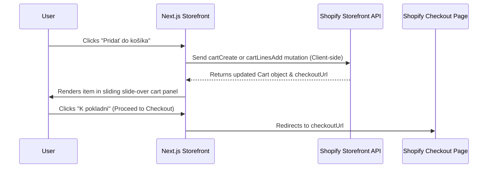

# Next.js Storefront Blueprint

This document defines the Next.js App Router front-end architecture, routing models, GraphQL integration, cart management, and SEO metadata configuration for the modern **Grow Medical** headless storefront.

---

## 1. Directory Structure

The project uses Next.js App Router with TypeScript and Tailwind CSS:

```
c1growmedical-storefront/
├── src/
│   ├── app/
│   │   ├── layout.tsx             # Root layout (Provider wrapping, Global CSS)
│   │   ├── page.tsx               # Homepage
│   │   ├── sitemap.ts             # Dynamic sitemap.xml generator
│   │   ├── robots.ts              # Dynamic robots.txt configuration
│   │   ├── products/
│   │   │   └── [handle]/
│   │   │       └── page.tsx       # Product Details Page (PDP) - ISR
│   │   ├── collections/
│   │   │   └── [handle]/
│   │   │       └── page.tsx       # Collection Listing Page (PLP) - ISR
│   │   ├── search/
│   │   │   └── page.tsx           # Search Results - SSR/Dynamic
│   │   └── cart/
│   │       └── page.tsx           # Fallback local cart view
│   ├── components/
│   │   ├── ui/                    # Reusable atom components (button, input, etc.)
│   │   ├── product/               # Product Card, Product Gallery, Price component
│   │   ├── cart/                  # Slide-over cart drawer, quantity selectors
│   │   └── layout/                # Header, Footer, Navigation menu
│   ├── lib/
│   │   ├── shopify/
│   │   │   ├── index.ts           # Shopify GraphQL fetch client
│   │   │   ├── queries.ts         # Catalog fetch queries
│   │   │   └── mutations.ts       # Cart creation & modification mutations
│   │   └── utils.ts               # CSS helpers (clsx, tailwind-merge)
│   └── types/
│       └── shopify.d.ts           # Type definitions for Storefront API schemas
├── public/
│   └── favicon.ico
├── tailwind.config.ts
├── tsconfig.json
└── package.json
```

---

## 2. Shopify GraphQL Client Setup

We implement a simple, lightweight server-side Shopify client using standard `fetch` with native cache configurations.

### `src/lib/shopify/index.ts`
```typescript
const domain = process.env.SHOPIFY_STORE_DOMAIN;
const storefrontAccessToken = process.env.SHOPIFY_STOREFRONT_ACCESS_TOKEN;
const apiVersion = '2024-04'; // Shopify API Version

export async function shopifyFetch<T>({
  query,
  variables = {},
  cache = 'force-cache', // Default to SSG/ISR caching
  tags = []
}: {
  query: string;
  variables?: any;
  cache?: RequestCache;
  tags?: string[];
}): Promise<{ status: number; body: T }> {
  try {
    const result = await fetch(`https://${domain}/api/${apiVersion}/graphql.json`, {
      method: 'POST',
      headers: {
        'Content-Type': 'application/json',
        'X-Shopify-Storefront-Access-Token': storefrontAccessToken!
      },
      body: JSON.stringify({
        query,
        variables
      }),
      cache,
      next: { tags } // Cache tags for on-demand revalidation via webhooks
    });

    const body = await result.json();

    if (body.errors) {
      throw body.errors[0];
    }

    return {
      status: result.status,
      body: body.data
    };
  } catch (error) {
    console.error('Shopify API Error:', error);
    throw error;
  }
}
```

---

## 3. Product Details Page & Dynamic Metadata (PDP)

Using **Incremental Static Regeneration (ISR)**, the PDP fetches details statically and regenerates on-demand when stock or detail changes occur.

### `src/app/products/[handle]/page.tsx`
```typescript
import { Metadata } from 'next';
import { notFound } from 'next/navigation';
import { shopifyFetch } from '@/lib/shopify';
import { getProductQuery } from '@/lib/shopify/queries';
import { Product } from '@/types/shopify';

interface Props {
  params: { handle: string };
}

// Generate Dynamic SEO Metadata
export async function generateMetadata({ params }: Props): Promise<Metadata> {
  const { handle } = params;
  const { body } = await shopifyFetch<{ product: Product }>({
    query: getProductQuery,
    variables: { handle }
  });

  const product = body.product;
  if (!product) return {};

  return {
    title: product.seo.title || product.title,
    description: product.seo.description || product.description,
    openGraph: {
      title: product.title,
      description: product.description,
      images: product.featuredImage ? [{ url: product.featuredImage.url }] : []
    }
  };
}

export default async function ProductPage({ params }: Props) {
  const { handle } = params;
  const { body } = await shopifyFetch<{ product: Product }>({
    query: getProductQuery,
    variables: { handle }
  });

  const product = body.product;
  if (!product) {
    notFound();
  }

  // Structured Data (JSON-LD) for Google Search Rich Results
  const jsonLd = {
    '@context': 'https://schema.org',
    '@type': 'Product',
    name: product.title,
    description: product.description,
    image: product.featuredImage?.url,
    offers: {
      '@type': 'Offer',
      price: product.variants.nodes[0].price.amount,
      priceCurrency: product.variants.nodes[0].price.currencyCode,
      availability: product.variants.nodes[0].availableForSale 
        ? 'https://schema.org/InStock' 
        : 'https://schema.org/OutOfStock'
    }
  };

  return (
    <>
      <script
        type="application/ld+json"
        dangerouslySetInnerHTML={{ __html: JSON.stringify(jsonLd) }}
      />
      <main className="max-w-7xl mx-auto px-4 py-8">
        <div className="lg:flex lg:gap-x-8">
          {/* Gallery Component */}
          {/* Information & Cart Actions Component */}
        </div>
      </main>
    </>
  );
}
```

---

## 4. Client-side Cart & Checkout Flow

To maintain high performance, we bypass Vercel server overhead for checkout by communicating directly with Shopify's high-speed Cart API:



---

## 5. SEO Configurations (Sitemap & Robots)

### Sitemap: `src/app/sitemap.ts`
```typescript
import { MetadataRoute } from 'next';
import { shopifyFetch } from '@/lib/shopify';

export default async function sitemap(): Promise<MetadataRoute.Sitemap> {
  const baseUrl = process.env.NEXT_PUBLIC_SITE_URL || 'https://growmedical.sk';
  
  // 1. Fetch all products handles
  // 2. Fetch all collections handles
  // 3. Map to URLs
  
  return [
    { url: baseUrl, lastModified: new Date() },
    // product URLs, collection URLs...
  ];
}
```

### Robots: `src/app/robots.ts`
```typescript
import { MetadataRoute } from 'next';

export default function robots(): MetadataRoute.Robots {
  const baseUrl = process.env.NEXT_PUBLIC_SITE_URL || 'https://growmedical.sk';
  return {
    rules: {
      userAgent: '*',
      allow: '/',
      disallow: ['/cart', '/checkout', '/account', '/search']
    },
    sitemap: `${baseUrl}/sitemap.xml`
  };
}
```
